**English** | [中文](README.zh.md)

<br>

# RARK — Robot Agent Runtime Kernel

**The missing execution layer between your LLM and your robot.**

[](https://python.org)
[](LICENSE)
[](rark/tests/)

---

## Why does this exist?

Large language models are getting remarkably good at deciding *what* a robot should do. The harder problem — one that receives far less attention — is making sure the robot actually *does it reliably*.

Consider a household robot mid-task:

```
→ Pouring water into a cup (60% complete)
→ Obstacle sensor fires
→ Should stop immediately and avoid the obstacle
→ Should resume pouring water exactly where it left off
→ Should survive a power cut in the middle of any of this
```

Current solutions fall into two traps:

| Approach | Problem |
|---|---|
| **FSM / behavior trees** | Hardcoded transitions; adding a new task means rewriting the graph |
| **LLM controls execution directly** | No preemption, no recovery, no priority — the model has no notion of "drop everything right now" |

**RARK** is a small, focused runtime kernel that sits between the decision layer and the hardware layer. It handles exactly the problems neither FSMs nor LLMs were designed to solve.

---

## What RARK does

```mermaid
flowchart TB
    DL["🧠 Decision Layer — LLM · planner · human"]

    subgraph RARK["⚙️  RARK"]
        f1["◆ Priority preemption  — interrupt any task now"]
        f2["◆ Suspend & resume     — pick up exactly where left off"]
        f3["◆ Task dependencies    — A finishes before B starts"]
        f4["◆ Automatic retry      — transient faults, handled"]
        f5["◆ Crash recovery       — reboot, carry on"]
        f6["◆ REST API             — drive from anything"]
    end

    EL["🤖 Execution Layer — ROS 2 · hardware · APIs"]

    DL -->|"HTTP / Python API"| RARK
    RARK -->|"async def skill(task)"| EL
```



The LLM decides **what** to do. RARK decides **whether the robot can do it right now** and manages everything between "start" and "done" — including obstacles, crashes, and retries.

---

## Quickstart

### Install

```bash
pip install -e ".[server]"   # FastAPI + uvicorn included
pip install -e ".[dev]"      # adds pytest + httpx
```

### Write skills, run them

A **skill** is just an `async def`. Register it, and RARK handles the rest:

```python
import asyncio
from rark import SkillRunner, Task

runner = SkillRunner(db_path="robot.db")

@runner.skill("navigate_to")
async def navigate_to(task: Task) -> None:
    target = task.metadata.get("target", "base")
    print(f"navigating to {target}…")
    await move_base_to(target)            # your hardware call here

@runner.skill("avoid_obstacle")
async def avoid_obstacle(task: Task) -> None:
    await emergency_stop()
    await back_up_slowly()

async def main():
    await runner.start()
    asyncio.create_task(runner.run_loop())

    await runner.submit(Task(name="navigate_to", priority=3,
                             metadata={"target": "kitchen"}))

    # 2 seconds later, something urgent happens
    await asyncio.sleep(2)
    await runner.interrupt(Task(name="avoid_obstacle", priority=10))
    # navigate_to is paused, avoid_obstacle runs, navigate_to resumes

asyncio.run(main())
```

### Or drive it over HTTP

```bash
# Start the demo server (mock skills, swap for real ones)
python -m rark.examples.server_demo

# Submit a task
curl -X POST http://localhost:8000/tasks \
     -H "Content-Type: application/json" \
     -d '{"name": "pour_water", "priority": 5, "metadata": {"cup": "A3"}}'

# Interrupt with something urgent
curl -X POST http://localhost:8000/interrupt \
     -H "Content-Type: application/json" \
     -d '{"name": "avoid_obstacle", "priority": 10}'

# Check what's happening
curl http://localhost:8000/health
```

Interactive docs at **`http://localhost:8000/docs`**.

---

## Core features

### Preemption — the real kind

`priority` is an integer. The highest number wins. When an interrupt arrives, the running skill is cancelled via `asyncio.Task.cancel()` — not queued behind the current task, not deferred, **immediately stopped**.

```python
Task(name="pour_water",     priority=3)   # normal operation
Task(name="avoid_obstacle", priority=10)  # drops everything
```

Here is what actually happens inside RARK when the obstacle sensor fires mid-pour:

```mermaid
sequenceDiagram
    participant LLM as 🧠 Planner
    participant K   as ⚙️ RARK
    participant S   as skill coroutine
    participant HW  as 🤖 Hardware

    LLM->>K: submit pour_water (priority=3)
    K->>S: asyncio.create_task(pour_water)
    S->>HW: move_arm_to_cup()
    S-->>K: metadata["stage"] = 1  (checkpoint written)

    Note over LLM,HW: obstacle sensor fires 💥

    LLM->>K: interrupt avoid_obstacle (priority=10)
    K->>S: asyncio.Task.cancel()
    Note over K: pour_water → PAUSED<br/>(stage=1 persisted to SQLite)
    K->>S: asyncio.create_task(avoid_obstacle)
    S->>HW: emergency_stop()
    S->>HW: back_up_slowly()
    Note over K: avoid_obstacle → COMPLETED

    K->>S: asyncio.create_task(pour_water) ← resumes at stage=1
    S->>HW: tilt_and_pour()
    Note over K: pour_water → COMPLETED ✓
```



### Suspend & resume with checkpoints

Interrupted tasks enter `PAUSED` and rejoin the queue. Skills can write checkpoints to `task.metadata` so they don't start over from scratch:

```python
@runner.skill("pour_water")
async def pour_water(task: Task) -> None:
    stage = task.metadata.get("stage", 0)

    if stage < 1:
        task.metadata["stage"] = 1        # persisted before awaiting
        await move_arm_to_cup()           # interrupted here? no problem

    if stage < 2:
        task.metadata["stage"] = 2
        await tilt_and_pour()
```

Metadata is written to SQLite at every state transition. Checkpoints survive reboots.

### Task dependencies

Sequence tasks without hardcoding order:

```python
nav  = Task(name="navigate_to_kitchen", priority=5)
grab = Task(name="grasp_cup",           priority=5, blocked_by={nav.id})
pour = Task(name="pour_water",          priority=5, blocked_by={grab.id})

# Submit all three; RARK runs them in order automatically
for t in (nav, grab, pour):
    await runner.submit(t)
```

### Retry for transient failures

```python
Task(
    name="read_sensor",
    priority=5,
    metadata={"max_retries": 3, "retry_delay": 1.0},
)
# Fails → retry after 1s → retry → retry → FAILED (if still failing)
```

### Crash recovery

Every transition is persisted before it takes effect. On restart, RARK replays:

```python
# Default: resume interrupted tasks from their last checkpoint
runner = SkillRunner(db_path="robot.db", crash_policy="resume")

# Safety-first: mark crashed tasks FAILED, require explicit resubmit
runner = SkillRunner(db_path="robot.db", crash_policy="fail")
```

---

## Task lifecycle

```mermaid
stateDiagram-v2
    direction LR

    [*]       --> PENDING   : submit()
    PENDING   --> ACTIVE    : scheduler tick
    ACTIVE    --> PENDING   : exception (retry budget left)
    ACTIVE    --> PAUSED    : interrupt()
    ACTIVE    --> COMPLETED : skill returns
    ACTIVE    --> FAILED    : exception (budget exhausted)
    ACTIVE    --> CANCELLED : cancel()
    PAUSED    --> ACTIVE    : scheduler tick

    COMPLETED --> [*]
    FAILED    --> [*]
    CANCELLED --> [*]

    note right of PAUSED
        metadata checkpoint
        preserved in SQLite —
        skill resumes from
        last written stage
    end note
```



---

## REST API

| Method | Path | Description |
|---|---|---|
| `GET` | `/health` | Kernel status + active task |
| `GET` | `/tasks` | All tasks |
| `POST` | `/tasks` | Submit a task (201) |
| `GET` | `/tasks/{id}` | Get task by ID |
| `DELETE` | `/tasks/{id}` | Cancel a task |
| `POST` | `/interrupt` | High-priority interrupt |

---

## Why this matters for embodied intelligence

The current wave of embodied AI assumes that the hard part is reasoning — and large models are making rapid progress there. But deploying those models on physical hardware exposes a different class of problems that reasoning alone cannot solve:

**Temporal contention.** The physical world is serial. A robot arm cannot pour water and dodge an obstacle simultaneously. Someone has to arbitrate — and it cannot be the model, because the model has no awareness of real-time hardware state.

**Partial execution.** Unlike software, physical actions cannot be atomically rolled back. A task that runs 60% and is then abandoned leaves the robot in an undefined physical state. The system needs explicit semantics for what "interrupted" means.

**Fault tolerance.** Hardware is unreliable. Power is unreliable. A production robot that cannot survive a transient sensor failure or a process crash is not a production robot.

**Separation of concerns.** LLMs are good at deciding *what* goals to pursue. They are not good at enforcing scheduling invariants, managing asyncio tasks, or recovering from database-level inconsistencies. These concerns should not be mixed.

RARK addresses each of these at the kernel level, so the intelligence layer can stay focused on intelligence.

---

## Project structure

```
rark/
├── core/
│   ├── task.py           Task dataclass + state machine
│   ├── transitions.py    Legal state transition rules
│   ├── events.py         Event types
│   ├── scheduler.py      Priority heap + dependency resolution
│   ├── kernel.py         Event loop, crash recovery, all handlers
│   └── runner.py         asyncio skill execution + retry
├── persistence/
│   └── sqlite_store.py   SQLite WAL store
├── server.py             FastAPI HTTP layer (create_app factory)
├── tests/                38 tests, four modules
└── examples/
    ├── interrupt_demo.py  CLI demo of preemption flow
    └── server_demo.py     Runnable HTTP server with mock skills
```

---

## Contributing

RARK is early-stage and there is a lot of interesting ground to cover. Contributions are welcome at every level.

**Good first issues:**
- Add a WebSocket endpoint that streams task state changes in real-time
- Write a ROS 2 skill adapter template (`async def ros_skill(task)` → action client)
- Add `blocked_by` and `retry` fields to the HTTP submit request
- Write an LLM integration example (OpenAI / Claude → `/tasks` API)

**Bigger projects:**
- Time-bounded tasks: `deadline` field that auto-cancels overdue tasks
- Task groups: submit a set of tasks as a unit, cancel all if any fails
- Observability: OpenTelemetry span injection at state transition hooks
- Persistent `blocked_by`: survive restarts for dependency chains

**How to contribute:**
1. Fork the repository
2. Create a branch: `git checkout -b feat/your-feature`
3. Write tests first — see `rark/tests/` for patterns
4. Open a PR with a clear description of what problem it solves

If you're unsure whether your idea fits, open an issue first.

---

## Running tests

```bash
pytest rark/tests/ -v    # 38 tests, should take < 1s
```

---

## License

MIT
