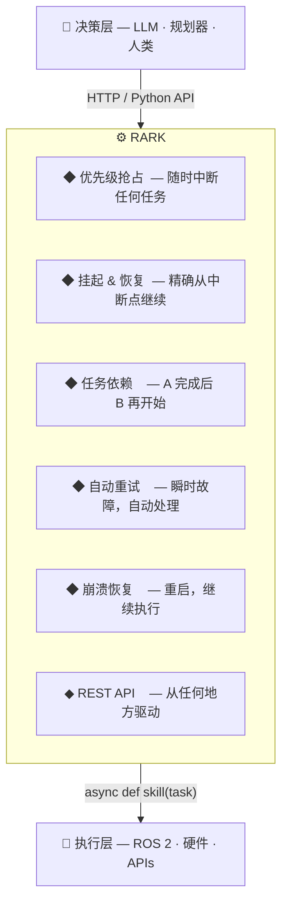
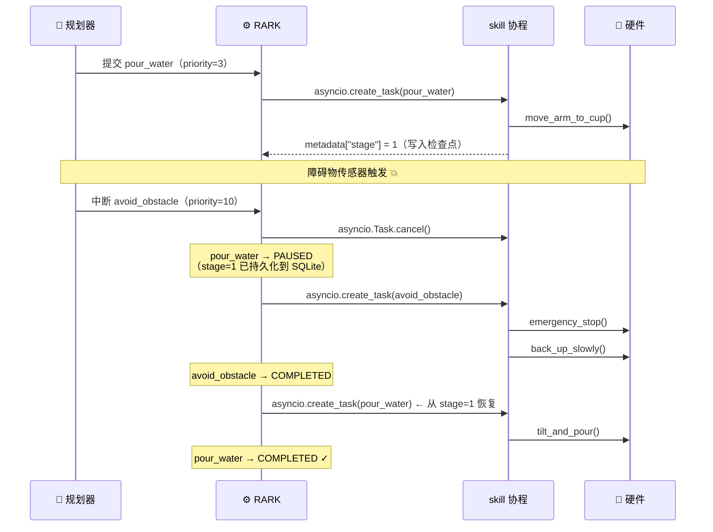
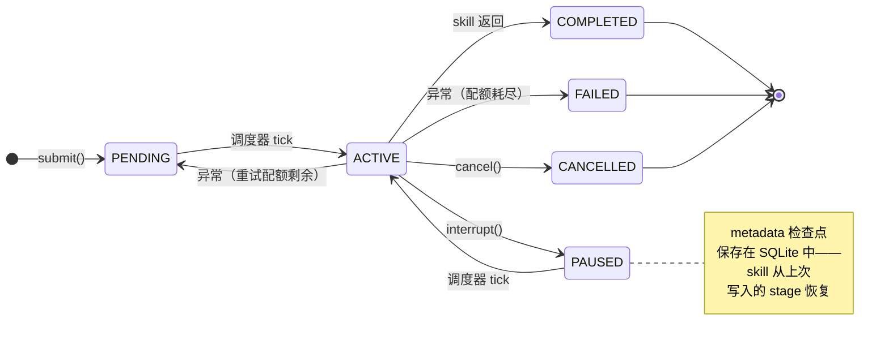

[English](README.md) | **中文**

<br>

# RARK — 机器人 Agent 运行时内核

**你的 LLM 与机器人之间缺失的执行层。**

[](https://python.org)
[](LICENSE)
[](rark/tests/)

---

## 为什么需要它？

大语言模型正在越来越擅长决定机器人*应该做什么*。更难的问题——却少有人关注——是如何确保机器人*真正可靠地把它做完*。

设想一台家庭机器人正在执行任务：

```
→ 正在倒水（已完成 60%）
→ 障碍物传感器触发
→ 应该立即停下并回避障碍
→ 应该从中断的地方继续倒水
→ 应该在上述任何阶段断电后都能正确恢复
```

现有方案陷入两个陷阱：

| 方案 | 问题 |
|---|---|
| **FSM / 行为树** | 转换关系硬编码；添加新任务意味着重写整张图 |
| **LLM 直接控制执行** | 没有抢占、没有恢复、没有优先级——模型没有"立刻放下一切"的概念 |

**RARK** 是一个小而专注的运行时内核，位于决策层和硬件层之间。它精确处理 FSM 和 LLM 都无法解决的那类问题。

---

## RARK 做什么



LLM 决定**做什么**。RARK 决定**机器人现在能不能做**，并管理从"开始"到"完成"之间的一切——包括障碍、崩溃和重试。

---

## 快速开始

### 安装

```bash
pip install -e ".[server]"   # 包含 FastAPI + uvicorn
pip install -e ".[dev]"      # 包含 pytest + httpx
```

### 编写技能并运行

**技能（skill）就是一个 `async def`**。注册它，RARK 负责其余的一切：

```python
import asyncio
from rark import SkillRunner, Task

runner = SkillRunner(db_path="robot.db")

@runner.skill("navigate_to")
async def navigate_to(task: Task) -> None:
    target = task.metadata.get("target", "base")
    print(f"正在前往 {target}…")
    await move_base_to(target)            # 在此调用你的硬件接口

@runner.skill("avoid_obstacle")
async def avoid_obstacle(task: Task) -> None:
    await emergency_stop()
    await back_up_slowly()

async def main():
    await runner.start()
    asyncio.create_task(runner.run_loop())

    await runner.submit(Task(name="navigate_to", priority=3,
                             metadata={"target": "kitchen"}))

    # 2 秒后，发生了紧急情况
    await asyncio.sleep(2)
    await runner.interrupt(Task(name="avoid_obstacle", priority=10))
    # navigate_to 暂停，avoid_obstacle 执行，navigate_to 恢复

asyncio.run(main())
```

### 或者通过 HTTP 驱动

```bash
# 启动演示服务器（包含 mock 技能，替换为真实技能即可）
python -m rark.examples.server_demo

# 提交一个任务
curl -X POST http://localhost:8000/tasks \
     -H "Content-Type: application/json" \
     -d '{"name": "pour_water", "priority": 5, "metadata": {"cup": "A3"}}'

# 用更紧急的任务中断
curl -X POST http://localhost:8000/interrupt \
     -H "Content-Type: application/json" \
     -d '{"name": "avoid_obstacle", "priority": 10}'

# 查看当前状态
curl http://localhost:8000/health
```

交互式 API 文档：**`http://localhost:8000/docs`**

---

## 核心特性

### 抢占——真正的抢占

`priority` 是一个整数，数值最大者获胜。中断到来时，正在运行的技能通过 `asyncio.Task.cancel()` 被取消——不是排在当前任务后面，不是延迟执行，而是**立刻停止**。

```python
Task(name="pour_water",     priority=3)   # 正常操作
Task(name="avoid_obstacle", priority=10)  # 放下一切
```

以下是障碍物传感器触发时 RARK 内部的实际执行过程：



### 挂起 & 恢复，支持检查点

被中断的任务进入 `PAUSED` 并重新加入调度队列。技能可以向 `task.metadata` 写入检查点，这样恢复时就不必从头开始：

```python
@runner.skill("pour_water")
async def pour_water(task: Task) -> None:
    stage = task.metadata.get("stage", 0)

    if stage < 1:
        task.metadata["stage"] = 1        # await 之前同步写入，cancel 不会丢失
        await move_arm_to_cup()           # 在此中断？没问题

    if stage < 2:
        task.metadata["stage"] = 2
        await tilt_and_pour()
```

每次状态转换时 metadata 都会写入 SQLite。检查点可以跨重启存活。

### 任务依赖

无需硬编码顺序即可对任务排序：

```python
nav  = Task(name="navigate_to_kitchen", priority=5)
grab = Task(name="grasp_cup",           priority=5, blocked_by={nav.id})
pour = Task(name="pour_water",          priority=5, blocked_by={grab.id})

# 一次性提交全部三个；RARK 自动按顺序执行
for t in (nav, grab, pour):
    await runner.submit(t)
```

### 瞬时故障自动重试

```python
Task(
    name="read_sensor",
    priority=5,
    metadata={"max_retries": 3, "retry_delay": 1.0},
)
# 失败 → 1 秒后重试 → 重试 → 重试 → FAILED（如果仍然失败）
```

### 崩溃恢复

每次转换在生效前均已持久化。重启时，RARK 恢复执行：

```python
# 默认：从最后一个检查点恢复被中断的任务
runner = SkillRunner(db_path="robot.db", crash_policy="resume")

# 安全优先：将崩溃任务标为 FAILED，需要显式重提交
runner = SkillRunner(db_path="robot.db", crash_policy="fail")
```

---

## 任务生命周期



---

## REST API

| 方法 | 路径 | 说明 |
|---|---|---|
| `GET` | `/health` | 内核状态 + 当前活跃任务 |
| `GET` | `/tasks` | 所有任务 |
| `POST` | `/tasks` | 提交任务（201） |
| `GET` | `/tasks/{id}` | 按 ID 查询任务 |
| `DELETE` | `/tasks/{id}` | 取消任务 |
| `POST` | `/interrupt` | 高优先级中断 |

---

## 对具身智能的意义

当前具身 AI 的浪潮普遍假设难点在于推理——大型模型正在这方面快速进步。但将这些模型部署到物理硬件上，会暴露出一类完全不同的问题，单靠推理能力无法解决：

**时间竞争。** 物理世界是串行的。机械臂无法同时倒水和躲避障碍物。必须有人仲裁——而这个仲裁者不能是模型，因为模型对实时硬件状态毫无感知。

**部分执行。** 与软件不同，物理动作无法原子回滚。一个任务执行到 60% 后被放弃，会让机器人处于未定义的物理状态。系统需要对"被中断"意味着什么给出明确的语义。

**容错性。** 硬件不可靠，电源不可靠。一个无法在瞬时传感器故障或进程崩溃后存活的生产机器人，不能算是真正的生产机器人。

**关注点分离。** LLM 擅长决定*追求什么目标*。它们不擅长执行调度不变式、管理 asyncio 任务，或从数据库级不一致中恢复。这些关注点不应混为一谈。

RARK 在内核层面解决上述每一个问题，让智能层专注于智能本身。

---

## 项目结构

```
rark/
├── core/
│   ├── task.py           Task 数据类 + 状态机
│   ├── transitions.py    合法状态转换规则
│   ├── events.py         事件类型
│   ├── scheduler.py      优先级堆 + 依赖解析
│   ├── kernel.py         事件循环、崩溃恢复、所有处理器
│   └── runner.py         asyncio 技能执行 + 重试
├── persistence/
│   └── sqlite_store.py   SQLite WAL 存储
├── server.py             FastAPI HTTP 层（create_app 工厂）
├── tests/                38 个测试，四个模块
└── examples/
    ├── interrupt_demo.py  抢占流程 CLI 演示
    ├── server_demo.py     带 mock 技能的可运行 HTTP 服务器
    └── llm_demo.py        LLM 规划器 → RARK 集成示例
```

---

## 贡献

RARK 处于早期阶段，有很多有趣的方向可以探索。欢迎各个层次的贡献。

**适合入门的 issue：**
- 添加 WebSocket 端点，实时推送任务状态变化
- 编写 ROS 2 技能适配器模板（`async def ros_skill(task)` → action client）
- 在 HTTP 提交请求中暴露 `blocked_by` 和 `retry` 字段
- 编写 LLM 集成指南（扩展 `examples/llm_demo.py`）

**较大的项目：**
- 时限任务：`deadline` 字段，超时自动取消
- 任务组：作为一个单元提交一组任务，任意一个失败则全部取消
- 可观测性：在状态转换钩子处注入 OpenTelemetry span
- 持久化 `blocked_by`：让依赖链在重启后存活

**如何贡献：**
1. Fork 本仓库
2. 创建分支：`git checkout -b feat/your-feature`
3. 先写测试——参考 `rark/tests/` 中的模式
4. 提交 PR，清楚描述它解决了什么问题

如果不确定你的想法是否契合项目方向，请先开一个 issue 讨论。

详细贡献指南请参阅 [CONTRIBUTING.md](CONTRIBUTING.md)。

---

## 运行测试

```bash
pytest rark/tests/ -v    # 38 个测试，应在 1 秒内完成
```

---

## 文档

| 文档 | 说明 |
|---|---|
| [架构设计（中文）](docs/zh/02-architecture.md) | 内部设计、时间尺度边界、at-least-once 语义 |
| [Architecture (English)](docs/en/02-architecture.md) | 同上，英文版 |
| [设计哲学（中文）](docs/zh/01-philosophy.md) | RARK 存在的理由与核心抽象 |
| [Philosophy (English)](docs/en/01-philosophy.md) | 同上，英文版 |

---

## 开源协议

MIT
